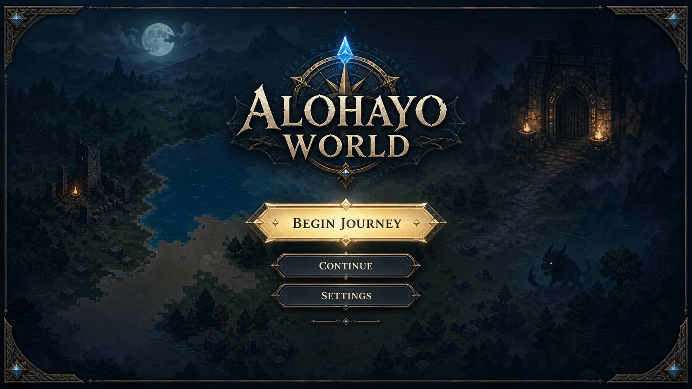
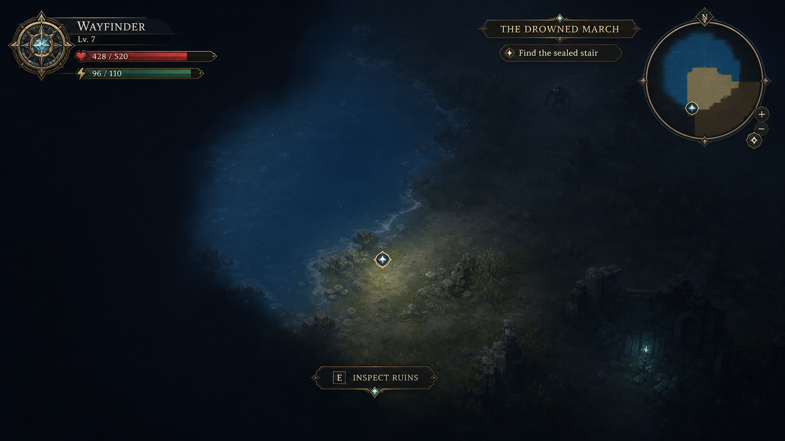
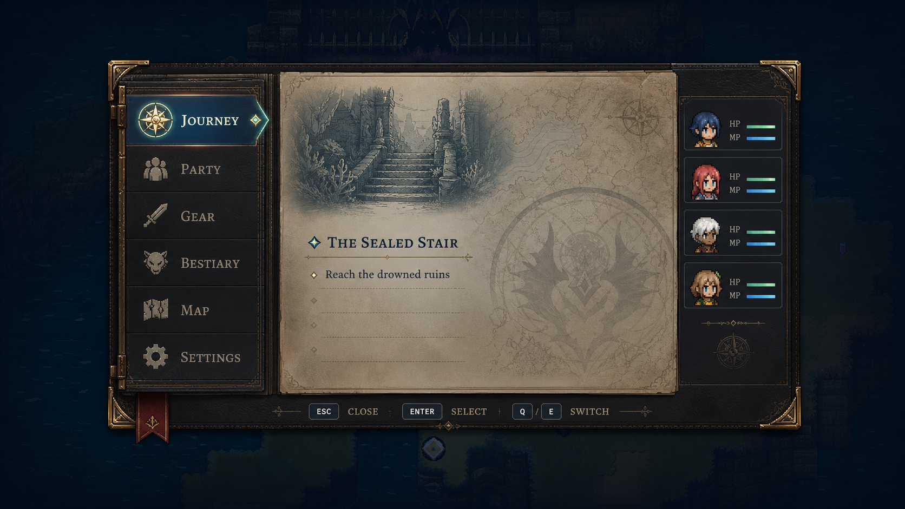

# JRPG UI System

Issue [#56](https://github.com/GarfieldZHU/alohayo-world/issues/56) owns the staged delivery
of the splash, HUD, and game-menu shell. This document is the durable design and
architecture contract for that work.

## Player promise

The interface should make Alohayo World feel like a mysterious map-first JRPG without
turning the map into a dashboard. Monsters, ruins, dungeons, and future party systems are
suggested through wayfinding motifs and honest extension points. The live world remains
the visual authority.

## Visual studies

The studies were generated with the built-in ImageGen workflow on 2026-08-01. They are
directional references only and are deliberately excluded from the runtime bundle.

### Splash: the threshold



The splash uses a compass crest, moonlit terrain, a distant dungeon gate, and one dominant
entry action. Its useful lesson is hierarchy, not the amount of ornament: the production
surface uses code-native borders, gradients, and a small crest instead of a full bitmap.

### HUD: the wayfinder edge



The HUD keeps status at the edge, preserves the center and lower-middle playfield, and
shows interaction only when it is relevant. Fake HP, MP, party, and quest data are not
permitted. Until their modules exist, the implementation presents explorer, terrain,
discovery, objective, and action state that the engine already owns.

### Menu: the field folio



The pause menu is an enchanted cartographer's folio: one section rail, one active content
plane, visible focus, and a dimmed perimeter that keeps the world recognizable. Party,
Gear, Bestiary, Map, Journey, and Settings are stable extension destinations; unavailable
systems use explicit empty states.

## Wayfinder Relic language

### Palette

| Token         | Dark value                 | Purpose                        |
| ------------- | -------------------------- | ------------------------------ |
| `--aw-ink`    | `#071718`                  | primary-action ink             |
| `--aw-deep`   | `rgba(5, 20, 22, 0.94)`    | deepest modal and edge field   |
| `--aw-panel`  | `rgba(10, 39, 39, 0.90)`   | smoky vellum surface           |
| `--aw-teal`   | `#82d7c8`                  | interactive emphasis           |
| `--aw-mint`   | `#d2f5df`                  | focus and compass gem          |
| `--aw-silver` | `#e8efe4`                  | primary readable text          |
| `--aw-brass`  | `#cbb06a`                  | restrained frame and separator |
| `--aw-line`   | `rgba(174, 225, 205, .28)` | quiet dividers                 |

Light theme keeps the fantasy material language but increases backing opacity and uses
dark ink text. Theme values remain scoped to `.aw-game-ui`.

### Materials and shapes

- smoky vellum: layered translucent navy gradients without runtime blur;
- aged brass: one-pixel borders, corner cuts, and restrained selection lines;
- compass gem: a small rotated square used as the common focus/wayfinding anchor;
- cartography: low-opacity contour lines and grid marks created with CSS gradients;
- folio: a single layered menu plane, never a wall of equal-weight cards.

### Type

Short titles use a readable fantasy serif stack (`Palatino`, `Book Antiqua`, Georgia).
Body copy and controls use the host-safe UI sans stack. Diagnostics stay in the existing
monospace surface and are hidden behind normal game UI.

### Motion

- 180–240 ms opening veil and panel arrival;
- 100–140 ms focus/selection response;
- no looping decoration;
- no animation that competes with camera movement;
- `prefers-reduced-motion: reduce` removes transforms and shortens fades to effectively
  immediate state changes.

## Surface budgets

### Splash

- full container overlay only before play;
- one primary action and at most two secondary actions;
- gameplay input is gated while visible;
- presented only after `data-initial-presentation="complete"`.

### HUD

- one upper-left identity cluster;
- one small objective/area ribbon away from the minimap;
- one transient lower prompt;
- roughly 22% maximum persistent desktop coverage;
- center and lower-middle remain clear during movement;
- mobile collapses detail labels before increasing coverage.

### Menu

- desktop maximum width `min(980px, calc(100% - 40px))` and maximum height around 78%;
- mobile becomes a safe-area-aware full surface with horizontally scrollable tabs;
- only one content panel is active;
- the world remains visible around the desktop perimeter;
- menu state gates movement, actions, dev pointer controls, and minimap shortcuts.

## Public configuration

```ts
interface GameUiOptions {
  enabled?: boolean
  splash?: boolean
  hud?: boolean
  minimap?: boolean
  menu?: boolean
}

interface MountGameOptions {
  ui?: boolean | GameUiOptions
}
```

Resolution is deterministic:

| Launch state              | Resolved behavior                                |
| ------------------------- | ------------------------------------------------ |
| normal game, `ui` omitted | splash, HUD, minimap, and menu enabled           |
| dev mode, `ui` omitted    | all four disabled                                |
| `ui: false`               | all four disabled                                |
| `ui: true`                | all four enabled, including explicit dev preview |
| object                    | `enabled` plus individual surface flags          |

The object form defaults `enabled` to normal-game behavior. `minimap` is independently
switchable, while HUD visibility remains the parent visibility gate for the field map. A
host that wants a dev-mode preview must set `enabled: true` explicitly. Entering the game
HUD also expands a legacy collapsed map once, so the restored map never reads as missing.

## Runtime ownership

DOM owns text, focus, buttons, menus, responsive layout, and accessibility. PixiJS owns
terrain, character rendering, world-space effects, lighting, fog, and the minimap drawing.
The UI consumes a read-only `GameUiSnapshot` assembled by the engine. It never mutates
simulation state directly.

The engine owns one modal gate shared by splash and menu. When the gate is active:

1. held movement keys are cleared;
2. character stepping and actions are ignored;
3. dev drag, zoom, and teleport input is ignored;
4. focus stays in the active surface;
5. closing restores the previous focus target when it still exists.

All nodes, listeners, and callbacks are owned by the returned `GameHandle` and removed by
`destroy()`.

## Panel boundary

The first slice has stable panel IDs:

```text
journey | party | gear | bestiary | map | settings
```

Each panel consumes presentation data only. Future modules may register panel descriptors
through an engine capability, but JSON content never supplies executable UI. The initial
slice maps existing systems as follows:

| Panel    | Initial authority                                           |
| -------- | ----------------------------------------------------------- |
| Journey  | current exploration objective and discovery progress        |
| Party    | active generated explorer; explicit single-member state     |
| Gear     | generated equipment and active weapon slot                  |
| Bestiary | honest empty state until creature ownership lands           |
| Map      | position, biome/region, seed, loaded/discovered counts      |
| Settings | HUD visibility, locale/theme handoff, and control reference |

## Accessibility and input

- splash is an `aria-modal` dialog with an immediate primary action;
- menu is an `aria-modal` dialog with a labelled tablist and tabpanels;
- selected tabs use `aria-selected` and roving `tabindex`;
- `Escape` and `M` toggle the game menu in normal game mode;
- `H` toggles the HUD (and hides the map with it); `N` toggles the integrated field map;
- `Q`/`E`, arrows, Home/End, pointer, and touch switch tabs while the menu is open;
- visible `:focus-visible` treatment uses teal plus a light outline;
- input fields and content-editable hosts retain normal typing behavior;
- English and Simplified Chinese are first-class.

In dev mode, `M` keeps its existing minimap shortcut because the game menu is disabled by
default. Explicitly enabling game UI in dev mode gives the menu priority.

## Performance contract

- no generated concept bitmap is imported by application or engine code;
- UI snapshot updates are dirty/cadenced rather than per-cell DOM rebuilds;
- no `backdrop-filter` or continuous decorative animation;
- hidden panels use `hidden` and are not updated as separate animation loops;
- the work must not weaken the frame budgets tracked by issue #55;
- standalone and remote embed retain lazy engine loading before the host Start action.

## Delivery phases

1. **Foundation:** public config, resolver tests, scoped DOM root, splash/HUD/menu vertical
   slice, input gate, diagnostics, i18n, lifecycle cleanup.
2. **Adapters:** save-backed Continue, quest/party/creature/inventory/dungeon panel
   descriptors, transient reward/danger layers.
3. **Polish:** mobile/safe-area refinements, accessibility audit, richer theme packs,
   restrained authored splash art.
4. **Evidence:** held-key input-gating tests, desktop/mobile screenshots, performance
   comparison, standalone/blog deploy verification, bilingual Wiki publication.

## Acceptance checklist

- default normal game exposes the splash, HUD, integrated field map, and menu;
- dev mode and `ui: false` preserve the previous world-first presentation;
- Escape/M opens and closes the menu without leaked movement;
- all six initial tabs are keyboard and pointer navigable;
- all visible values are real or explicitly unavailable;
- locale, theme, resize, pause/resume, remount, and destroy are safe;
- screenshots still read first as a game world;
- fog, shoreline, minimap, and rendering behavior do not regress.
