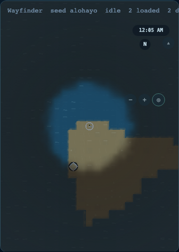

# Terrain Texture Rendering Foundation

**Status:** feature branch `codex/wasm-terrain-texture-foundation` · procedural vertical slice
and original eight-family atlas contract complete · bitmap promotion tracked in [issue #64](https://github.com/GarfieldZHU/alohayo-world/issues/64)

The map face now has a deterministic texture language without moving terrain authority into
WASM or adding a 3D asset path. The texture layer is presentation metadata: it enriches the
existing biome colors, contours, water materials, fog, and weather surfaces while leaving
terrain IDs, topology, hydrology, movement, and saves unchanged.

## Rendering boundary

```text
stable biome + climate fields
          │
          ├─ TypeScript reference ─┐
          └─ Rust/Wasm batch       ├─ 1 packed Uint8Array layer / chunk
                                   │
                       worker transfer + fallback diagnostics
                                   │
                         Pixi regional-details Graphics batch
                                   │
               water ripples · sand grain · grass · forest · reeds
               rock facets · snow grain · volcanic/ash marks
```

`prepare_chunk_texture_hints` receives the existing biome, elevation, moisture, and
temperature arrays plus world origin. It returns one chunk-local array exactly
`chunkSize * chunkSize`:

| Layer                 | Meaning                                              | Authority                |
| --------------------- | ---------------------------------------------------- | ------------------------ |
| `pattern` high nibble | recipe family selected from the stable biome code    | content/biome mapping    |
| `pattern` low nibble  | deterministic density budget from biome/climate/hash | world-space integer hash |

WASM never creates pixels, Pixi objects, or draw calls. TypeScript reuses the existing
render-hint noise for grain and direction, then owns motif selection, color, alpha, LOD, and
the disposable `Graphics` lifecycle. The renderer reuses the existing regional-details batch,
so the feature does not add one display object or one texture per cell.

The worker accepts missing, malformed, or failing WASM output and regenerates the identical
TypeScript reference. Canvas diagnostics expose `data-worker-terrain-texture-hints` and the
batch is included in transfer-byte and fallback accounting.

## Visual language

- water: short current ripples using the biome accent;
- coast: fine sand striations;
- grass: restrained upright flecks;
- forest: paired canopy flecks with base-color variation;
- wetland: reed-like vertical marks;
- arid: dry horizontal grain;
- upland/mountain: simple rock facets;
- snow: sparse cool-white grain;
- volcanic: dark triangular ash/rock marks.

The overlay appears only above the normal detail LOD threshold and remains subordinate to
the existing terrain palette. Chunk boundaries are not used as a phase: every variation is
derived from world coordinates, so eviction, reload, negative coordinates, and neighboring
chunks do not reset the motif field.

## Asset pipeline decision

The current map is a flat PixiJS surface, so GLB, 3D materials, and per-chunk bitmap textures
would be the wrong first asset boundary. The first slice is assetless and deterministic; this
keeps startup, streaming, seam behavior, and mobile memory predictable while the terrain
system remains the visual authority.

`assets/terrain-texture-atlas.svg` is the first project-original, palette-neutral eight-family
atlas with transparent gutters. `TerrainAtlasResidency` tracks chunk references, bytes, LRU
eviction, and LOD 0/1 selection. Safe/balanced quality, low-memory devices, and reduced motion
choose LOD 1. The atlas is not yet the default Pixi texture path: optimized bitmap loading,
mobile GPU-memory measurements, and procedural-versus-authored browser comparison still need
to pass before shipping it as the renderer authority.

## Evidence




The screenshots were captured from the `#game` surface after a browser zoom pass. They verify
that the map remains visible beneath the texture layer at desktop and narrow mobile sizes.

## Verification and rollout

- Rust unit test covers deterministic families and output bounds.
- TypeScript reference test covers negative origins and moved-chunk variation.
- Built-WASM parity test covers 4/16/32 cell chunks, positive/negative origins, and seam-adjacent coordinates.
- Browser E2E covers WASM diagnostics, explicit TypeScript fallback, missing-artifact fallback,
  destroy/navigation paths, and desktop/mobile screenshots.
- Existing terrain, render-hint, hydrology, content, and save contracts remain unchanged.

The feature branch enables the new batch by default after parity and browser gates pass. A
promotion benchmark and any bitmap-atlas comparison remain separate follow-up work; the
TypeScript path stays loadable as the durable fallback.
