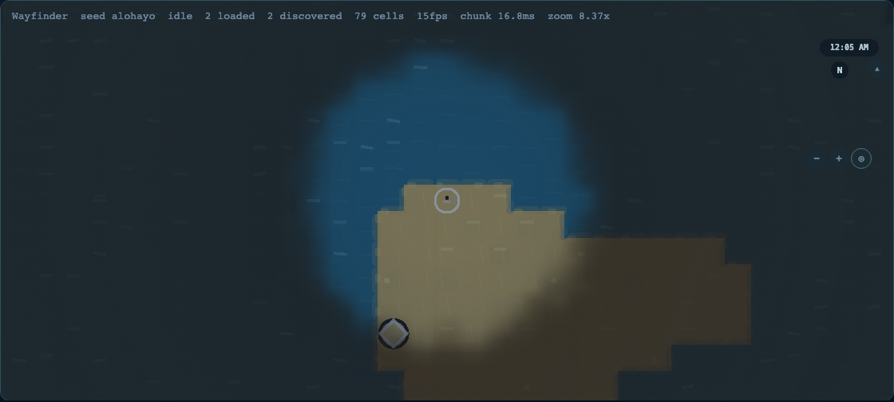

# World and Terrain

> **Wiki page version:** EN 1.5.0 · **Product baseline:** v0.1.3 · **Updated:** 2026-08-09
> **中文:** [世界与地形](World-and-Terrain-zh-CN) · **Translation status:** synced with EN 1.5.0

The map is the central simulation model. Terrain is derived from continuous geography,
not painted first and rationalized later. The same stable fields support exploration,
roads, settlements, creatures, weather, combat positioning, and authored regions.

## Geographic Layers

| Layer             | Examples                                                       | Authority                        |
| ----------------- | -------------------------------------------------------------- | -------------------------------- |
| continuous fields | elevation, moisture, temperature, slope                        | deterministic generator          |
| hydrology         | filled elevation, D8 flow, accumulation, watershed, depression | map/Wasm raster                  |
| topology          | ocean/lake body, mainland/island identity, retained aliases    | map topology resolver            |
| geomorphology     | erosion potential, sediment, deposition, floodplain            | deterministic metadata           |
| terrain/material  | forest, desert, wetland, mountain, glacier                     | biome classification + config    |
| features          | rivers, roads, settlements, authored overlays                  | typed feature layers             |
| surfaces          | water, mud, snow, frost, ash, burn scars                       | reversible weather/action layers |
| presentation      | contours, transitions, details, fog, lighting                  | engine renderer                  |

Ocean versus lake and mainland versus island are topology. River is a linear hydrology
feature that crosses cells. Bay, gulf, strait, delta, cave, peninsula, cliff, and valley
belong to feature/landform layers. Keeping these separate avoids duplicate biomes and lets
gameplay ask precise questions.

## Core Terrain Catalog

| Stable ID          | English        | 中文     | Frequency | Primary condition and gameplay identity                       |
| ------------------ | -------------- | -------- | --------- | ------------------------------------------------------------- |
| `core:deep-ocean`  | Deep Ocean     | 深海     | common    | very low, remote ocean; blocks ordinary foot travel           |
| `core:ocean`       | Open Ocean     | 远洋     | common    | edge-connected water beyond shallows; navigation and storms   |
| `core:shallow-sea` | Shallow Sea    | 浅海     | common    | near-land low-depth water; boats, shoals, sediment            |
| `core:coast`       | Coast          | 海岸     | common    | near sea level and water; ports, tides, flooding              |
| `core:lake`        | Lake           | 湖泊     | uncommon  | enclosed inland water; freshwater, boats, drainage            |
| `core:beach`       | Beach          | 海滩     | uncommon  | sandy low-slope coast; loose/wet sand transitions             |
| `core:basin`       | Basin          | 盆地     | uncommon  | low relief enclosed by higher land; fertile but flood-prone   |
| `core:lowland`     | Lowland Plain  | 低地平原 | common    | low relief; easiest roads, farms, towns, and travel           |
| `core:grassland`   | Grassland      | 草原     | common    | moderate open land; fast travel, herds, fire                  |
| `core:forest`      | Forest         | 森林     | common    | moist temperate land; resources, concealment, slower movement |
| `core:desert`      | Desert         | 沙漠     | uncommon  | hot and dry; heat, thirst, loose sand, storms                 |
| `core:wetland`     | Wetland        | 湿地     | uncommon  | saturated low ground; mud, flood, causeways                   |
| `core:highland`    | Highland       | 高地     | common    | elevated broken ground; wind, cold rain, passes               |
| `core:bare-rock`   | Bare Rock      | 裸岩     | uncommon  | thin soil and exposed stone; scree, minerals, poor roads      |
| `core:mountain`    | Mountain       | 高山     | uncommon  | very high rugged relief; climbing, falls, barrier routes      |
| `core:snow`        | Snowfield      | 雪原     | uncommon  | cold snow-covered land; traction, cold, whiteout              |
| `core:tundra`      | Tundra         | 苔原     | uncommon  | cold treeless land; frozen travel and thaw cycles             |
| `core:savanna`     | Savanna        | 稀树草原 | uncommon  | hot seasonal grass/trees; open travel, heat, fire             |
| `core:rainforest`  | Rainforest     | 雨林     | rare      | hot and very wet; biomass, disease, poor visibility           |
| `core:marsh`       | Marsh          | 沼泽     | rare      | very wet warm lowland; sink mud, reeds, boats                 |
| `core:plateau`     | Plateau        | 高原     | rare      | high but locally level ground; open upland and scarps         |
| `core:canyon`      | Canyonlands    | 峡谷荒原 | rare      | dry rugged relief; chokepoints, cliffs, flash floods          |
| `core:reef`        | Coral Reef     | 珊瑚礁   | rare      | warm shallow water; biodiversity and boat hazards             |
| `core:oasis`       | Oasis          | 绿洲     | rare      | groundwater refuge in arid land; settlement pressure          |
| `core:volcano`     | Volcanic Field | 火山地   | very rare | rugged hotspot; heat, gas, ash, rare resources                |
| `core:glacier`     | Glacier        | 冰川     | very rare | cold high ice mass; crevasses, sliding, melt                  |

## Per-Terrain Physics Contract

Every terrain definition has:

- real-world description and Alohayo behavior;
- generation weight and required environmental conditions;
- allowed surface layers;
- movement, control, exposure, entry capability, and hazard behavior;
- destructibility and transformation methods;
- creature habitat tags, settlement suitability, road cost, and palette.

The machine authority is `content/core/terrain-rules.json` plus
`content/core/biomes.json`. `docs/TERRAIN_RULES.md` is the complete readable catalog.
English and Chinese labels are required before a terrain can pass content validation.

## Surfaces and Transformation

Weather and actions first add temporary surfaces: rain produces water and mud; snow
settles on roads and canopy; thaw creates slush; heat melts ice; fire leaves burn scars.
Surfaces fade or evolve without replacing the base terrain. A transformation changes the
terrain only when the rule explicitly says the underlying material changed, for example
long-term glacier melt toward snowfield/lake or saturated sand toward wet sand and runoff.

Destruction is therefore layered: remove a tree or snow cover without deleting the soil;
excavate a road or mine without pretending rock became grass; flood a plain temporarily
before a persistent geomorphology system decides whether deposition creates new land.

## Streaming and Determinism

Chunks are deterministic for generator version, seed, coordinates, size, and resolved
content. Nearby chunks are retained, distant chunks evicted, and topology summaries kept
beyond the render horizon. Negative coordinates and load order must not change output.
The same seed reproduces hashes and fields; authored overlays apply in stable pack order.

## Transport, Weather, and Traffic Features

Road generation can emit one deterministic sparse structure per qualifying route:
bridges, causeways, ferries, and switchbacks carry stable IDs, midpoint coordinates,
required capability tags, movement multipliers, and maintenance rates. These records are
part of streamed chunk/world hashes and are consumed by a shared traversal query; PixiJS
markers are presentation only.

`sampleRegionalWeather` provides a region identity, front strength, wind, precipitation,
accumulation, visibility, comfort, and a short forecast from seed, position, and the
simulation clock. Aggregate settlement traffic consumes the same weather sample and
transport records for bounded demand, congestion, maintenance, and supply diagnostics.
The normal game HUD stays quiet; these values are developer-facing canvas diagnostics.

## Water Terrain and Seams

Water has three different authorities which must not be collapsed into one biome label:

| Question                                   | Current authority | Meaning                                               |
| ------------------------------------------ | ----------------- | ----------------------------------------------------- |
| Is this water ocean-connected or enclosed? | topology resolver | ocean/sea vs lake identity                            |
| Which way does local drainage flow?        | hydrology raster  | D8 direction, accumulation, local watershed component |
| How should the renderer soften a shore?    | render hint       | local signed shoreline distance and contours          |

The shoreline field is signed: negative for water, positive for land, zero on a water/land
boundary, and `+/-127` when no known shoreline is present. The initial worker hint is local;
the renderer rebuilds it from a one-cell loaded-neighbor halo when seam context arrives.
It drives ocean shelf, beach, cliff, lake-bank, estuary, delta, marsh, and reef materials
under the contour renderer; it never changes terrain IDs, movement, or topology.

Discovery fog is one linearly filtered GPU texture over the rendered neighborhood. Its
typed pixel preparation uses the same world-space visibility field as CPU action checks,
smooths discovery memory between cell centers, and updates only the old/new vision union
during travel. PixiJS owns the texture; map and gameplay state remain renderer-independent.

Dynamic geomorphology starts as a disabled-by-default map simulation over explicitly active
drainage cells. Its first phase keeps integer sediment, deposited material, water, and tick
state; every fixed step reports exact retained/exported/saturated mass and sparse changed
cells. Outlet records are intentionally local and provisional until #38 supplies canonical
drainage identities. The live terrain and saves do not consume this state yet.

Every chunk also publishes a `ChunkDrainageSummary` with its cardinal flow handoffs. Its
state is `provisional`: chunks have not yet reconciled a halo or canonical watershed
identity. Issue [#38](https://github.com/GarfieldZHU/alohayo-world/issues/38) owns
halo generation, pairwise seam reconciliation, graph identities, persistence, and
load-order benchmarks. Issue [#41](https://github.com/GarfieldZHU/alohayo-world/issues/41)
delivered the halo shoreline, GPU fog, specialized water materials, and downstream river
profile baseline. Never use a local field as proof that a river ends at a chunk edge.
Issue [#44](https://github.com/GarfieldZHU/alohayo-world/issues/44) owns promotion from the
local accounting kernel to canonical persistent erosion, flooding, channel evolution, and
delta growth.

## Terrain Texture Presentation

The feature branch adds a presentation-only `terrain-texture-hints` batch. It receives the
existing biome and climate arrays and returns one compact packed `pattern` byte layer. Its
high nibble is the recipe family and its low nibble is density. Rust/Wasm prepares semantic
recipes; TypeScript/PixiJS reuses existing render-hint noise and chooses the motif, palette,
alpha, LOD, and display lifecycle in the existing regional-details batch.

The overlay adds water ripples, coast striations, grass flecks, forest clusters, wetland reeds,
rock facets, snow grain, and volcanic marks without changing terrain IDs, topology, hydrology,
movement, saves, or the existing terrain colors. World-coordinate variation prevents chunk
reloads and negative coordinates from resetting the visual phase.

The first slice is intentionally assetless because this is a flat PixiJS map. An optional
palette-neutral project-original or verified-CC0 2D atlas, with residency and mobile LOD
budgets, is tracked in [#64](https://github.com/GarfieldZHU/alohayo-world/issues/64); GLB is not
part of this rendering boundary.

## Developer Showcase

`core:terrain-showcase` places all 26 types near the origin for i18n, rendering, movement,
road, weather, and rule testing. It is opt-in dev content and never part of normal world
generation.
